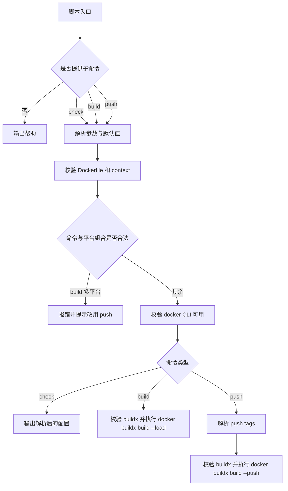

## Docker image 推送脚本说明

本仓库只发布 `linux/arm64`：`push` 的默认平台就是 `linux/arm64`，`amd64` 不再构建。

### 职责

| 命令 | 职责 | 输入 | 输出 | 依赖 | 关键约束 |
| --- | --- | --- | --- | --- | --- |
| `check` | 校验镜像推送所需配置 | CLI 参数、环境变量、`package.json` | 解析后的镜像配置与校验结果 | Node.js、Docker CLI、`Dockerfile` | 不执行构建或推送；不要求 buildx |
| `build` | 本地构建 Docker image | `--image` `--tag` `--extra-tags` `--platform` `--dockerfile` `--context` | `docker buildx build --load` 执行结果 | Docker CLI、buildx | 仅构建，不推送；`--load` 只支持单平台，多平台直接报错 |
| `push` | 构建并推送 Docker image | 同 `build` | `docker buildx build --push` 执行结果 | Docker CLI、buildx、已登录的镜像仓库 | 单次构建即发布全部 tag；主 tag 不是 `latest` / `dev` 时，自动连带推送 `latest` |

### 输入解析

| 参数 | 默认值 | 说明 |
| --- | --- | --- |
| `--image` | `docker.io/lonemoonspace/weread-challenge` | 目标镜像仓库 |
| `--tag` | `package.json` 中的 `version` | 主 tag |
| `--extra-tags` | 空 | 额外 tag，使用英文逗号分隔 |
| `--platform` | `build`: 宿主平台；`check` / `push`: `linux/arm64` | 目标平台，英文逗号分隔；会先去空白并去重 |
| `--dockerfile` | `Dockerfile` | 构建使用的 Dockerfile 路径 |
| `--context` | `.` | Docker build context |

### 流程

### 关键约束

| 约束 | 说明 |
| --- | --- |
| 仅 arm64 | 只发布 `linux/arm64`；`push` 未显式传 `--platform` 时按 `linux/arm64` 发布，单次 buildx 调用同时推送全部 tag，不会再把别的架构推上去 |
| 帮助优先 | 空参数或 `help/-h/--help` 仅输出帮助文本 |
| 默认最小化 | `build` 默认只处理一个主 tag；额外 tag 必须显式传入 `--extra-tags` |
| 版本来源 | 未传 `--tag` 时，主 tag 直接取 `package.json.version` |
| 版本发布补 latest | `push` 时如果主 tag 不是 `latest` 也不是 `dev`，自动把 `latest` 一起构建并推送 |
| `dev` 推送入口 | `npm run docker:image:push:dev` 固定把当前仓库实现推送到 `dev` tag |
| 显式失败 | 参数缺失、未知参数、构建命令在 Docker 或 buildx 不可用时、文件不存在时直接报错并退出 |
| 先校验参数后校验环境 | 非法的命令与平台组合在检查 docker 之前就报错，避免被「docker 不可用」掩盖 |
| check 不要求 buildx | `check` 只解析与校验配置，不执行构建，因此不会因为环境缺少 buildx 插件而失败 |
| build 仅单平台 | `build` 使用 `--load`，多平台无法载入本地镜像，直接报错并提示改用 `push` |
| 平台串归一化 | `--platform` 会去空白并去重后再转发；`buildx` 不会 trim，`containerd` 也会拒绝空白，原样转发只会在 buildx 内部才失败 |
