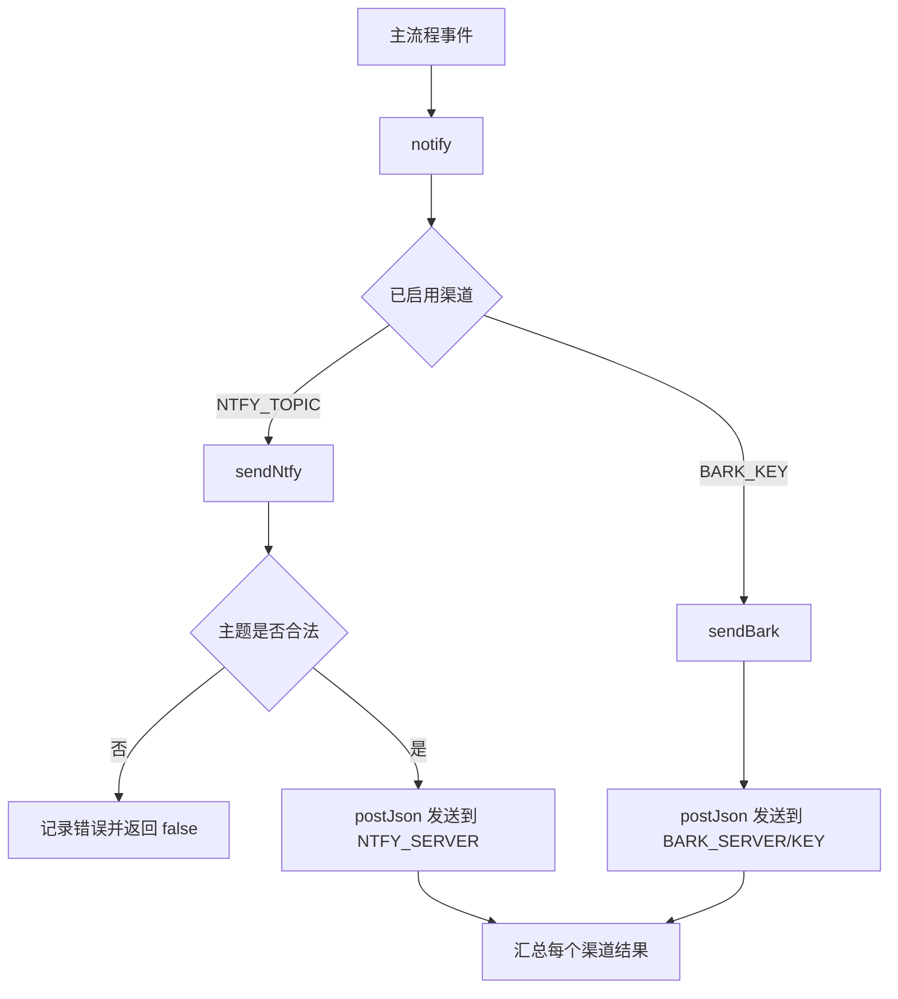

## 推送通知说明

### 职责

| 组件 | 职责 | 输入 | 输出 | 依赖 | 关键约束 |
| --- | --- | --- | --- | --- | --- |
| `notify(title, body, options)` | 统一推送入口，向所有已启用渠道并行发送 | 标题、正文、渠道无关选项 | 每个渠道的成功/失败结果数组 | 已启用的渠道配置 | 单渠道失败不影响其他渠道，也不中断主流程 |
| `sendBark(title, body, options)` | Bark 渠道实现（iOS） | `BARK_KEY`、`BARK_SERVER` | Bark HTTP 请求结果 | `https` / `http` | 保持原有请求路径与负载字段不变 |
| `sendNtfy(title, body, options)` | ntfy 渠道实现（Android 推荐） | `NTFY_*` 配置 | ntfy HTTP 请求结果 | `https` / `http` | 主题非法时本地拦截，不发起请求 |
| `postJson(url, payload, headers)` | 渠道共用的 JSON POST 实现 | 目标地址、负载、附加请求头 | `{ ok, status, body, error }` | `https` / `http` | 带 15s 超时，超时/网络错误统一回落为失败结果 |

### 渠道与启用条件

| 渠道 | 适用平台 | 启用条件 | 服务端 |
| --- | --- | --- | --- |
| Bark | iOS | `BARK_KEY` 非空 | 默认 `https://api.day.app`，可用 `BARK_SERVER` 覆盖 |
| ntfy | Android / iOS / 桌面 | `NTFY_TOPIC` 非空 | 默认 `https://ntfy.sh`，可用 `NTFY_SERVER` 覆盖（支持自建） |

### 选项映射

主流程只调用 `notify`，渠道差异在渠道实现内部消化：

| `notify` 选项 | Bark 负载字段 | ntfy 负载字段 |
| --- | --- | --- |
| `title` | `title` | `title`（有 `subtitle` 时拼接为 `title · subtitle`） |
| `body` | `body` | `message` |
| `subtitle` | `subtitle` | 并入 `title` |
| `sound` | `sound` | 映射为 `tags`（`alarm→rotating_light`、`birdsong→bell`、`success→tada`、`beginning→rocket`） |
| `level` | `level` | 映射为 `priority`（`passive→low`、`active→default`、`timeSensitive→high`、`critical→urgent`） |
| `url` | `url` | `click` |
| `image` | `image` | `attach`（外部图片 URL） |
| `group` | `group` | 忽略（ntfy 无分组概念） |
| `icon` | `icon` | `icon` |
| `actions` | 忽略 | `actions`（登录链接推送使用 `view` 按钮） |
| `markdown` | 忽略 | `markdown` |

### 覆盖项

| 环境变量 | 作用 | 取值 |
| --- | --- | --- |
| `NTFY_PRIORITY` | 覆盖 level 到优先级的默认映射 | `1-5` 或 `min,low,default,high,urgent,max` |
| `NTFY_TAGS` | 覆盖 sound 到标签的默认映射 | 逗号分隔的标签列表 |
| `NTFY_TOKEN` | ntfy Access Token 认证 | `Authorization: Bearer <token>` |
| `NTFY_USERNAME` + `NTFY_PASSWORD` | ntfy Basic Auth 认证 | `Authorization: Basic <base64>`，仅在未配置 Token 时生效 |

### 流程

### 关键约束

| 约束 | 说明 |
| --- | --- |
| 未配置即静默 | 渠道未配置时 `notify` 只打印提示，不报错、不阻塞主流程 |
| 失败隔离 | 各渠道通过 `Promise.allSettled` 并发发送，单渠道异常只影响自身结果 |
| 请求超时 | 所有推送请求 15s 超时，避免推送服务无响应时拖住阅读流程 |
| 主题即密码 | ntfy 公共服务器上主题名等价于密码，仅允许 `[-_A-Za-z0-9]`，长度不超过 64 |
| 登录链接去重 | 登录链接与二维码推送仍由 `notifyLoginLink` 的 `lastPushedLoginLink` 去重 |
| 离线可验证 | `scripts/notify-smoke.js` 使用本地 mock 服务校验负载，不访问外网、不需要真实密钥 |
